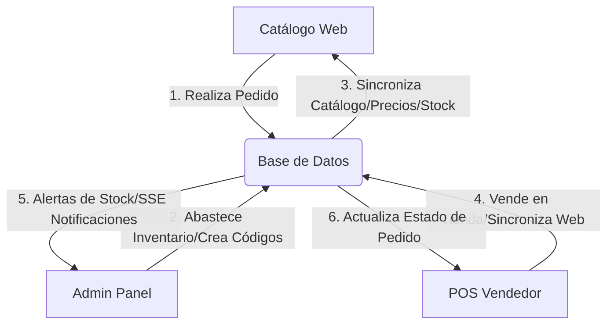

# ⚡ MANUAL DE USUARIO GENERAL — ECOSISTEMA REXERMI

Este manual documenta de forma exhaustiva el funcionamiento, flujos de trabajo, interacciones y configuraciones avanzadas de los cuatro módulos principales del sistema: **1. Catálogo Web de Clientes**, **2. Punto de Venta (POS) del Vendedor**, **3. Panel de Control Administrativo (Admin)** y **4. Módulo de Compatibilidad PWA y Dispositivos Móviles**.

---

# 📖 TABLA DE CONTENIDOS
1. [Flujo General de Datos e Interacción entre Módulos](#1-flujo-general-de-datos-e-interacción-entre-módulos)
2. [Módulo I: Catálogo Web de Clientes (Tienda Online)](#módulo-i-catálogo-web-de-clientes-tienda-online)
3. [Módulo II: Punto de Venta (POS - Vendedor)](#módulo-ii-punto-de-venta-pos---vendedor)
4. [Módulo III: Panel Administrativo (Admin)](#módulo-iii-panel-administrativo-admin)
5. [Módulo IV: Optimización Móvil, PWA y Usabilidad Táctil](#módulo-iv-optimización-móvil-pwa-y-usabilidad-táctil)
6. [Casos Prácticos y Ejemplos de Flujos Combinados](#casos-prácticos-y-ejemplos-de-flujos-combinados)
7. [Guía Rápida para el Lector de Códigos de Barras](#guía-rápida-para-el-lector-de-códigos-de-barras)

---

# 1. Flujo General de Datos e Interacción entre Módulos

El sistema Rexermi funciona como un ecosistema unificado en tiempo real sobre una base de datos centralizada (SQLite con modo de alta velocidad WAL).

---

# Módulo I: Catálogo Web de Clientes (Tienda Online)

Diseñado para que los clientes finales exploren productos, gestionen su carrito, realicen pedidos, califiquen compras e interactúen con soporte.

## 1.1 Exploración de Productos y Categorías
* **Cómo se usa**: El usuario ingresa a la raíz de la web (`/`), selecciona categorías en el menú lateral o superior, y escribe términos en la barra de búsqueda.
* **Para qué sirve**: Localizar productos rápidamente.
* **Qué afecta**: Consulta la tabla `products` en base de datos.
* **Ejemplo**: Escribir *"Caja"* filtra y muestra el paquete completo de mercancía.

## 1.2 Carrito de Compras Local
* **Cómo se usa**: Hacer clic en *"Agregar al carrito"* en las tarjetas de productos. Permite sumar/restar unidades en el panel lateral del carrito.
* **Para qué sirve**: Consolidar artículos antes de la compra.
* **Qué afecta**: Almacenado en el `localStorage` del navegador del cliente. No bloquea inventario hasta que se confirma el pedido.

## 1.3 Conversor de Moneda Multidivisa Flotante (USD / VES)
* **Cómo se usa**: En la barra superior de navegación, el usuario cuenta con un botón interactivo (`💵 USD` / `🇻🇪 VES`). Al presionarlo, todos los precios expuestos en el catálogo principal, los resultados de búsqueda predictiva y el desglose del carrito de compras se convierten al instante a bolívares venezolanos, calculados sobre la tasa de cambio registrada en la base de datos de administración.
* **Para qué sirve**: Facilitar al usuario la compra en la moneda oficial local sin realizar cálculos matemáticos manuales.

## 1.4 Notificaciones de Compras en Vivo (Social Proof)
* **Cómo se usa**: Mientras se navega por el catálogo, aparecerán ventanas emergentes interactivas de compras reales en la esquina inferior izquierda (ej: *"María G. en Valencia compró Harina PAN 🥖 hace 5 min"*).
* **Para qué sirve**: Demostrar que el sitio web posee flujo activo y generar un entorno de compras confiable (*social proof*).
* **Qué afecta**: Consulta la ruta de API `/api/recent-sales` la cual retorna únicamente pedidos reales y completados de la base de datos (ocultándose si no hay órdenes reales registradas y ofuscando el apellido para proteger la privacidad de los clientes).

## 1.5 Registro e Inicio de Sesión
* **Cómo se usa**: En `/login`, introduciendo correo y contraseña o registrando una nueva cuenta.
* **Para qué sirve**: Asociar pedidos a un historial personal, acumular puntos y habilitar líneas de crédito.
* **Qué afecta**: Crea/consulta filas en la tabla `users` mediante autenticación JWT segura.

## 1.6 Checkout y Envío de Pedidos
* **Cómo se usa**: En la pantalla de pago, el usuario ingresa sus datos de entrega (dirección, ciudad, método de envío) y selecciona el método de pago (Pago Móvil, Transferencia, Efectivo, Crédito o Puntos).
* **Para qué sirve**: Registrar formalmente una orden de compra web.
* **Qué afecta**: 
  - Crea una fila en la tabla `orders` en estado `pending`.
  - Envía notificaciones de sistema SSE en tiempo real al Panel Administrativo y al POS.

---

# Módulo II: Punto de Venta (POS - Vendedor)

Interfaz ultra-rápida y optimizada para la atención en tienda física. Cuenta con listeners agresivos de teclado y audio interactivo.

## 2.1 Apertura y Cierre de Turno (Caja Chica)
* **Cómo se usa**:
  - **Apertura**: Al iniciar sesión, si no hay turno activo, se exige ingresar el *"Monto de Apertura"* en efectivo (ej: `$100.00`).
  - **Cierre**: Al finalizar la jornada, se ingresa el *"Monto Contado Real"* físico. El sistema calcula automáticamente la discrepancia frente al saldo teórico de ventas.
* **Para qué sirve**: Evitar pérdidas de dinero y cuadrar las cuentas de efectivo del día.
* **Qué afecta**: Inserta y actualiza registros en la tabla `cash_closures`.

## 2.2 POS Offline-First (Modo Sin Conexión con Sincronización)
* **Cómo se usa**:
  - El sistema detecta de forma automática la pérdida de acceso a internet mostrando un indicador rojo `🔴 Sin Conexión` en la cabecera.
  - Al estar offline, el POS carga el catálogo desde la memoria local del navegador permitiendo seguir agregando productos al carrito y facturando normalmente.
  - Al finalizar una venta offline, el pedido se guarda en una cola local encriptada (`localStorage`).
  - Al recuperar la conexión, aparece un botón en amarillo `🔄 Sincronizar (X)` permitiendo subir todas las ventas encoladas al servidor en lote con un solo clic.

## 2.3 Bloqueo Rápido por PIN de 4 Dígitos
* **Cómo se usa**: 
  - Al hacer clic en el botón `🔒 Bloquear` en el header del POS (o de forma automática tras minutos de inactividad), la pantalla se oscurece por seguridad.
  - Para desbloquearla, el cajero solo debe digitar un código PIN numérico de 4 dígitos creado previamente, sin tener que escribir su correo y contraseña larga de usuario.

## 2.4 Escaneo de Código de Barras e Integración de Cámara
* **Cómo se usa**:
  - **Lector de Mano**: Disparar el lector láser sobre el código de barras. Suena un beep agudo `♪` y se agrega 1 unidad.
  - **Cámara del Dispositivo**: Pulsar el icono `📷` en la barra de búsqueda. Se abrirá la cámara en un recuadro. Cuenta con un **interruptor de linterna (🔦)** para entornos de bodega con poca iluminación. Al detectar un código con éxito, el celular vibra y cierra el cuadro de escaneo agregando el producto.

## 2.5 Métodos de Pago Mixtos y Crédito
* **Cómo se usa**: En el panel lateral derecho, seleccionar los métodos de pago. El sistema permite **dividir el pago** (ej. `$20` en Efectivo y `$30` a Línea de Crédito del cliente), asociando números de referencia bancaria.
* **Para qué sirve**: Facilitar compras a clientes que no usan un solo medio de pago.
* **Qué afecta**: 
  - Resta el saldo disponible de crédito al cliente (`credit_used`).
  - Acumula puntos de fidelidad en la cuenta del cliente (`loyalty_points`).

---

# Módulo III: Panel Administrativo (Admin)

Centro de control para la toma de decisiones estratégicas, abastecimiento, control de stock y auditoría de personal.

## 3.1 Dashboard de Analíticas Premium Interactivas
* **Cómo se usa**: Pantalla de inicio del admin. Ofrece widgets visuales avanzados:
  - **Gráfico de Ventas (Spline Cúbico)**: Línea de tendencia interactiva dorada con filtro de brillo (neon glow), hover de coordenadas y degradado dinámico de fondo.
  - **Distribución de Métodos de Pago (Donut Chart)**: Gráfico circular interactivo de porciones flotantes al pasar el cursor para desglosar ingresos por canal.
  - **Productos más Vendidos**: Listado animado con barras horizontales de progreso.
* **Para qué sirve**: Monitorear visual y analíticamente la salud financiera del negocio.

## 3.2 Fichas de Productos y Desglose de Inventario
* **Cómo se usa**: En `/admin/products`. Permite crear y editar artículos.
  - **Auto-Desglose**: Marcar un producto como *"Subproducto"* y asociarlo a un *"Producto Padre"* con una tasa de rendimiento (ej: 1 caja de agua de 12 botellas rinde 12 unidades). Al vender una botella suelta sin stock en el POS, el sistema descuenta automáticamente 1 caja padre del inventario y suma 12 unidades al hijo para concretar la venta de forma transparente.
* **Para qué sirve**: Gestión minuciosa de existencias físicas y combos.
* **Qué afecta**: Inserta/actualiza filas en la tabla `products` (incluyendo fotos, precio de costo, alertas de stock crítico y códigos de barras).

## 3.3 Toma Física de Inventario (Auditoría de Stock)
* **Cómo se usa**: En el menú lateral *"Auditoría de Stock"* (`/admin/products/audit`). El usuario recorre los pasillos escaneando productos físicos con el lector láser o la cámara web del dispositivo. La tabla calcula discrepancias automáticas (Diferencias negativas en rojo, positivas en verde). Al guardar, se fuerza la corrección del stock en el sistema.
* **Para qué sirve**: Detectar robos, pérdidas o errores de caja en los estantes físicos.

---

# Módulo IV: Optimización Móvil, PWA y Usabilidad Táctil

Optimizaciones de usabilidad diseñadas para facilitar las ventas desde smartphones, tablets y terminales móviles en campo.

## 4.1 Carrito Flotante y Bottom Sheet (Drawer)
* **Cómo se usa**: En pantallas menores a `992px`, la columna lateral rígida de facturación desaparece. Al añadir un producto al carrito, aparece una barra flotante en la parte inferior de la pantalla. Al presionarla, se despliega una hoja deslizante hacia arriba (*Bottom Drawer*) con el listado del carrito, el selector de cliente y todos los controles de pago en un formato ergonómico para una sola mano.

## 4.2 Teclado Numérico Virtual Compacto (Custom Numpad)
* **Cómo se usa**: Al hacer foco en los campos de entrada de montos (como "Monto Recibido" o "Descuento") en la hoja de pago móvil, se previene el teclado por defecto del teléfono que cubre media pantalla. En su lugar, emerge un teclado numérico táctil personalizado en la base de la aplicación.

## 4.3 Gestos de Deslizamiento (Swipe to Delete)
* **Cómo se usa**: Dentro de la lista del carrito en smartphones, puedes **deslizar con el dedo hacia la izquierda** la tarjeta de un producto. Al desplazarla un 30%, se revela un botón rojo de "Borrar". Al deslizar por completo, el producto se elimina automáticamente con una vibración corta de confirmación física.

## 4.4 Vibraciones Táctiles Hápticas (Haptic Feedback)
* **Cómo se usa**: Al presionar botones de incremento/decremento en el carrito, añadir productos, introducir dígitos en el numpad o al finalizar una venta, el dispositivo móvil emitirá microvibraciones físicas de distinta duración y ritmo para confirmar que el toque fue exitoso.

---

# Casos Prácticos y Ejemplos de Flujos Combinados

## Caso A: Venta Offline en el POS y Sincronización Posterior
1. El POS se queda sin internet a mitad de una feria (cabecera muestra `🔴 Sin Conexión`).
2. El cajero agrega 3 *Bebidas Energéticas* al carrito y procesa el cobro en efectivo por `$9.00`.
3. El sistema valida la venta localmente, genera un ticket digital offline y encola el pedido en la cola local.
4. Al volver a la oficina y reconectarse a internet (`🟢 En Línea`), el cajero pulsa `🔄 Sincronizar (1)` en la barra superior.
5. El pedido se envía al servidor SQLite de forma automática, se actualiza el stock real y se imprime el ticket físico definitivo.

---

# Guía Rápida para el Lector de Códigos de Barras

Para asegurar el correcto funcionamiento de su lector láser:
1. **Configuración del Dispositivo**: Asegúrese de que su lector esté configurado en modo **Emulación de Teclado (USB HID)** con sufijo **Enter / Retorno de Carro (CR/LF)**. Esto viene activado por defecto en la mayoría de lectores del mercado.
2. **Foco Automático**: En las páginas del POS y de Auditoría del Admin, el sistema redirecciona agresivamente el foco al campo de escaneo. No haga clic fuera de los campos ni intente forzar el cursor, el sistema está diseñado para capturar la entrada automáticamente en cualquier momento.
3. **Entrada Manual**: Si el código de barras está desgastado y no lee, digite el número de barras en el buscador del POS/Auditoría y presione `Enter` en su teclado físico o active la cámara del dispositivo (`📷`) en la esquina de la barra de búsqueda.
